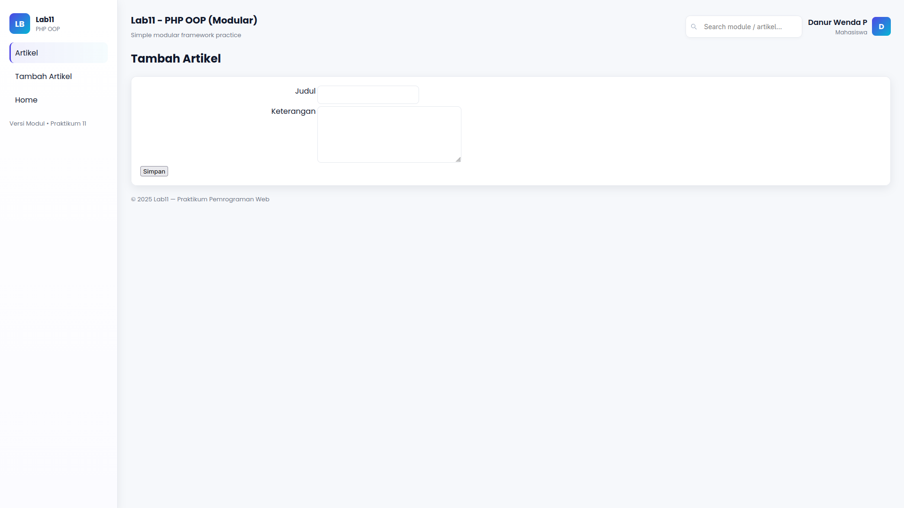

# Lab11 PHP OOP – CRUD Artikel

Projek praktikum Lab 11 Pemrograman Web.  
Aplikasi sederhana menggunakan **PHP OOP**, **routing modular**, dan **CRUD Artikel** dengan UI modern + modal hapus.

## Fitur
- Modular routing  
- CRUD Artikel (Create, Read, Update, Delete)  
- UI modern (pure CSS)  
 
## Struktur Folder
```bash
  lab11_php_oop/
  ├── assets/css/style.css
  ├── class/Database.php
  ├── class/Form.php
  ├── module/artikel/index.php
  ├── module/artikel/tambah.php
  ├── module/artikel/ubah.php
  ├── module/artikel/hapus.php
  ├── template/header.php
  ├── template/sidebar.php
  ├── template/footer.php
  ├── config.php
  ├── index.php
  └── .htaccess
```

## Screenshot
## Halaman Awal


## Tambah Artikel


## Daftar Artikel Bertambah


## Hapus Artikel

